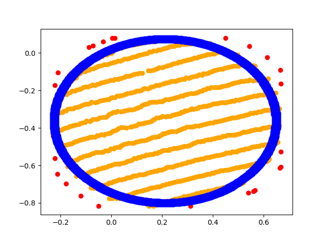

PFD_withVisualC++
==============

PFD(平面図形検出)をVisualC++で実装した。

概要
-----
PFDとは3次元点群から円や四角形などの平面図形のパラメータを検出することであり、道路周辺の3次元点群から標識の表示板の図形を検出することを目標としている。

今回は円、正三角形、長方形の3つを検出対象としている。


1. 輪郭抽出：モルフォロジー演算を利用して目標図形の輪郭を抽出することで、ノイズ点群の除去し図形の探索範囲を絞る

1. 平面図形検出：遺伝的アルゴリズムを利用して最適な図形パラメータを探索

環境
-----
- Windows10 64bit
- Visual Studio 2017 Community
  - opencv 3.4.3
  - matplotlib-cpp (Commits on Dec 20, 2019)
- Anaconda3 2019.10

使用方法
-----
シミュレーションで作成した点群を入力にして図形検出をする場合と、実際の点群を入力にする場合の2パターンに分けて設計した。

まずシミュレーションで作成した点群を入力にする場合のサンプルコードを示す。

```cpp
#include <iostream>
#include "work.h"

int main()
{
    // sign_type: 標識
	// 0:         半径0.3mの円
	// 1:         1辺0.8mの正三角形
	// 2:         1辺0.9mの正方形
	// 3:         1辺0.45mのひし形(正方形)
	int sign_type = 0; 

    // scale: 上記のサイズからの倍率
    int scale = 1;

    // density: 点群の密度(数/m^2)
	double density = 2500;

    // dilate_size, close_size, open_size, add_size:
    // モルフォロジー演算のカーネルサイズ
	// モルフォロジー演算がうまくいかなかったら
    // dilate_sizeを上げる必要あり
	int dilate_size = 50, close_size = 20, open_size = 70, add_size = 20;

	simulation(sign_type, scale, density, dilate_size, close_size, open_size, add_size);
}
```

**結果:**


(オレンジが二次元に射影した点群、赤が輪郭点、青が検出図形)

実際の点群を入力にする場合は、点群に平面検出をした後の、
平面にフィットした点群とその平面パラメータの2つを入力にとることを想定している。
平面検出は省略し、その2つを準備した際のサンプルコードを示す。

```cpp
#include <iostream>
#include <opencv2/opencv.hpp>

int main()
{
    // 入力点群
    cv::Mat_<double> points3d;

    // 平面パラメータ
    // 平面がax + by + cz = dで表されるとき
    // plane_p{a, b, c, d}である
    // ただし{a, b, c}は単位ベクトル
    std::vector<double> plane_p;

    // dilate_size, close_size, open_size, add_size:
    // モルフォロジー演算のカーネルサイズ
	// モルフォロジー演算がうまくいかなかったら
    // dilate_sizeを上げる必要あり
	int dilate_size = 50, close_size = 20, open_size = 70, add_size = 20;

    // ... 略

    //図形検出
    test(points3d, plane_p, dilate_size, close_size, open_size, add_size);
}
```
**結果:**



(オレンジが二次元に射影した点群、赤が輪郭点、青が検出図形)

課題
-----
- Python版より検出図形の精度が悪い
- Python版より動作が遅い
- matplotlib-cppでは3次元での点群描画ができないため、3次元グラフでの確認は別途モジュールが必要